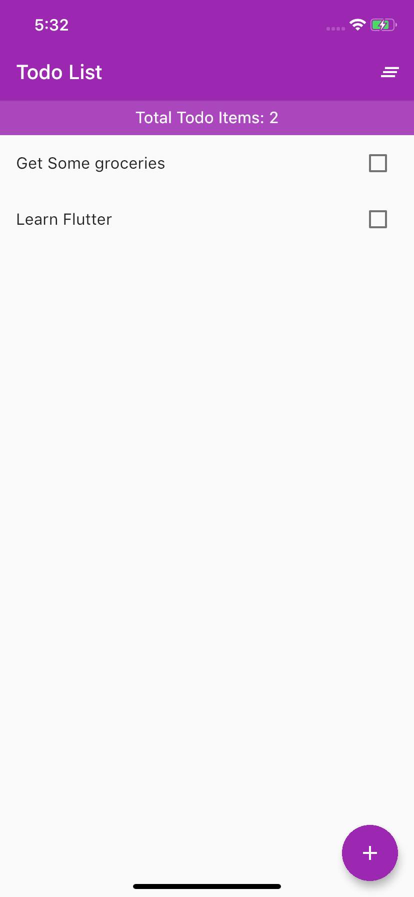

# todo_demo

Todo Sample Flutter Project created using the Concept of Stateful Widget to save state/items in our todo list.

Below is the snapshot of the project.

Functionalities:

- ~~List todos~~
- ~~Display Todo Count~~
- ~~Clear All Todos~~
- ~~Add New Todo~~

Todos: 😅

- Delete Todos (Swipe or Long tap to delete)
- Display Total Remaining and Completed Todos Count.
- Add Persistance For Saving Todo in either SQLite or SharedPreferences

Cheers.🍺 - Flutter Is Awesome 🤟 ⚡️
